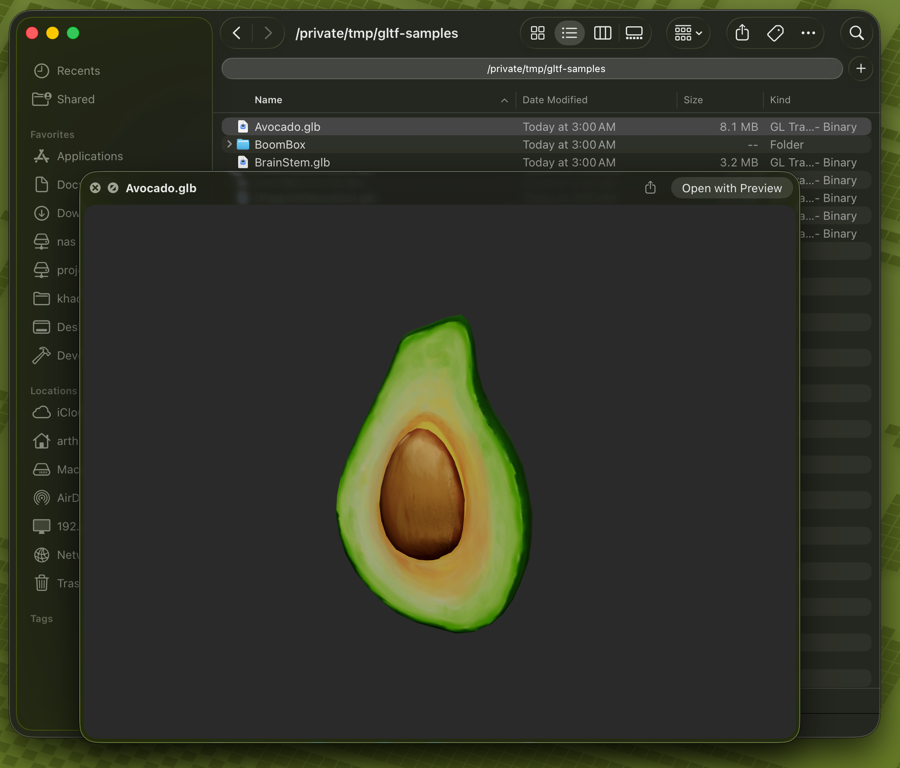

# QuickLookGLTF

<table>
<tr>
<td width="450">
<a href="demo.png"></a>
</td>
<td valign="top">

**A macOS Quick Look extension for previewing `.glb` and `.gltf` 3D model files.**

Built with [Three.js](https://threejs.org) running inside a WKWebView. Models load instantly thanks to Three.js's optimized glTF parser and GPU-accelerated rendering.

<small>

- Preview `.glb` and `.gltf` files with Quick Look (press Space in Finder)
- Orbit, zoom, and pan with mouse/trackpad
- Plays the first animation if the model has one
- Supports Draco, KTX2, and Meshopt compressed models
- Auto-frames the camera to fit the model
- Extensible via [custom scripts](#custom-scripts)

</small>

</td>
</tr>
</table>

## Install

### Homebrew

```bash
brew install arthurrmp/tap/quicklookgltf
```

### Manual

1. Download `QuickLookGLTF.zip` from the [latest release](https://github.com/arthurrmp/QuickLookGLTF/releases)
2. Unzip and move `QuickLookGLTF.app` to `/Applications`

### After installing

1. Open `QuickLookGLTF.app` from `/Applications` once to register the extension
2. Press Space on any `.glb` or `.gltf` file in Finder

<details>
<summary>Quick Look not working?</summary>

Check that the extension is enabled in System Settings:
- **macOS 15+:** General > Login Items & Extensions > scroll to Extensions > click the info button next to QuickLookGLTF > enable Quick Look
- **macOS 13 and 14:** Privacy & Security > Extensions > Quick Look > enable QuickLookGLTF

</details>

## Custom Scripts

You can run a custom JavaScript file after each model loads. Create `~/.config/quicklookgltf/custom.js` and it will be executed with access to `scene`, `camera`, `renderer`, `controls`, `gltf`, and `THREE`.

```js
scene.background = new THREE.Color(0xff0000);

scene.traverse((node) => {
    if (node.isMesh && node.material) {
        node.material.depthWrite = true;
    }
});
```

## Build from source

Requires macOS 13.0+, Xcode 15+, [XcodeGen](https://github.com/yonaskolb/XcodeGen), and Node.js.

```bash
xcodegen
npm install
npm run build
open QuickLookGLTF.xcodeproj
```

To update Three.js:

```bash
npm update three
npm run build
```

## License

MIT

## Acknowledgments

[Three.js](https://threejs.org) - MIT License, Copyright 2010-2026 three.js authors
